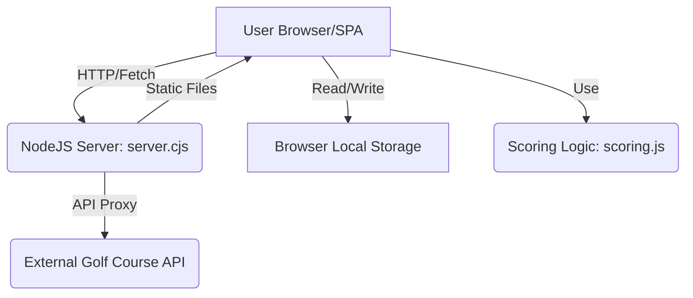

# Fairway Live architecture

> **Status:** Current implementation
>
> **Verification basis:** working tree based on uncommitted state (current files)

## 1. Executive summary
Fairway Live is a live golf scoring application that allows users to import golf courses from a third-party API and then set up interactive rounds for players to score. The system is comprised of a client-side Single Page Application (SPA) that manages the user experience, a lightweight NodeJS server that acts as a static file host and API proxy, and a pure business logic module for calculating golf scores. The one rule a contributor must not break is that all score calculations must strictly adhere to Stableford points methodology using player handicap, as verified by the unit tests.

## 2. System context
The system interacts with three main entities:
*   **Users:** Players/Hosts interact via the web interface (SPA).
*   **Golf Course API (External):** Provides raw course data (course names, locations, hole details, tee box information). This is accessed through the local server proxy.
*   **Local Data Storage:** All critical application data (course catalog, round definitions) is persisted in the browser's local storage.

A simplified diagram:

## 3. Architectural invariants
1.  **Data State Consistency:** The application's source of truth for course and round data is the browser's local storage (`CATALOG_KEY`, `ROUND_KEY`). All API data is materialized into this local storage before being used by the UI. This is enforced by the UI logic in `app.js`.
2.  **Handicap Calculation:** Handicap strokes are calculated deterministically based on the player's `playingHandicap` and the hole's `strokeIndex` using the formula: `floor(playingHandicap / 18) + (strokeIndex <= (playingHandicap % 18) ? 1 : 0)`. This is enforced by the `getHandicapStrokes` function in `scoring.js`, which is covered by unit tests in `scoring.test.js`.
3.  **Score Calculation:** Stableford points are calculated as `max(0, 2 + par - netScore)`, where `netScore = grossScore - handicapStrokes`. This is enforced by the `getStablefordPoints` function in `scoring.js` and is verified in `scoring.test.js`.

## 4. Components and dependencies
*   **Client (app.js):**
    *   **Owns:** UI rendering, User session state (local storage), Course and Round management interfaces.
    *   **Depends on:** Local Storage, Server API endpoints (`/api/golf/courses`), Scoring logic (`scoring.js` logic is used conceptually).
    *   **Does not own:** Golf course data (obtained externally), Server hosting.
*   **Server (server.cjs):**
    *   **Owns:** Static file serving, Secure communication layer (proxying external API calls).
    *   **Depends on:** NodeJS HTTP module, File System access.
    *   **Does not own:** Application business logic (scoring), Course data integrity (relies on external API).
*   **Scoring Logic (scoring.js):**
    *   **Owns:** Hand-calculated handicap and Stableford score computation functions.
    *   **Depends on:** Input parameters (Par, Handicap, Stroke Index, Gross Score).
    *   **Does not own:** Data fetching, User interface.
*   **External API (Golf Course API):**
    *   **Owns:** The master catalog of golf courses and tee box details.
    *   **Depends on:** External infrastructure.

## 5. Critical flows
**Course Import Flow (API to Catalog):**
1.  Client UI (`app.js`) sends search parameters (name, city, country) to the Server (`server.cjs`).
2.  Server (`server.cjs`) forwards the request to the External Golf Course API, using `GOLF_COURSE_API_KEY` for authorization.
3.  External API returns course search results.
4.  Client UI receives results, and when a course is selected for import, it calls `normalizeGolfApiCourse` (in `app.js`) to map raw API data into the internal system model.
5.  The normalized course data, including 18-hole tee sets, is saved to Browser Local Storage (`CATALOG_KEY`).

**Round Creation Flow (Catalog to Round):**
1.  User selects a Course and Tee Set from the local Catalog UI.
2.  Client UI performs a snapshot of the selected tee set data, including all hole parameters (Par, Stroke Index).
3.  A new round object is created, assigned a unique join code, and the status is set to "setup".
4.  The complete round object (including the immutable snapshot of the tee set) is appended to the list in Browser Local Storage (`ROUND_KEY`).

## 6. Interfaces and data
*   **External API Protocol:** Standard REST via HTTPS. Uses Bearer Token authentication (`GOLF_COURSE_API_KEY`). Endpoints include `/v1/search` (query parameters) and `/v1/courses/{id}` (path parameters).
*   **Internal Data Model (Local Storage):**
    *   `CATALOG_KEY`: Array of `Course` objects. Each course contains an array of `TeeSet` objects. A `TeeSet` contains an array of 18 `Hole` objects, each with `number`, `par`, `strokeIndex`, and `distance`.
    *   `ROUND_KEY`: Array of `Round` objects. Each round contains a `teeSetSnapshot` (a deep copy of the `TeeSet` data at creation time) and the `joinCode`.

## 7. Security and trust boundaries
*   **Trust Boundary:** The boundary exists between the local system (Client/Server) and the External Golf Course API.
*   **Authorization:** API access to external golf data is secured via a server-side `GOLF_COURSE_API_KEY`, preventing client exposure of credentials.
*   **Input Untrusted:** All user input (search terms, course name, score entries) is untrusted and sanitized (e.g., `escapeHtml` used in `app.js`).
*   **Failure Mode:** If the External Golf Course API is unavailable, the Server fails closed, returning a 502 error, preventing client import operations.

## 8. Failure, capacity, and operations
*   **Failure (API):** Proxying failure results in a 502 error response from the server to the client.
*   **Failure (Client):** Data loss is possible if the user clears browser local storage.
*   **Capacity:** Limited by the browser's local storage capacity and the performance of the single-threaded NodeJS server.
*   **Deployment:** The server is designed to be run locally (`http://127.0.0.1:4173`), suggesting a small, single-service deployment model.

## 9. Verification
*   **Scoring Logic:** The core business logic functions (`getHandicapStrokes`, `getStablefordPoints`, `getPlayerSummary`) are verified by the comprehensive unit tests in `scoring.test.js`.
*   **UI/Data Flow:** The integrity of the data flow from API search to local storage is verified by the implementation logic in `app.js` and the successful rendering in `app.js`'s rendering functions.
*   **Unverified:** Integration tests confirming the end-to-end round lifecycle (e.g., a player using a join code to score) are not explicitly present in the code provided.

## 10. Known limitations
*   **Data Persistence:** The entire application state (catalog, rounds) relies solely on browser Local Storage and is not backed by a persistent database.
*   **Authentication:** Authentication is implemented using a simple, temporary local storage-based "magic link" adapter, which is not a robust security mechanism for a production environment.
*   **API Reliance:** The system is entirely dependent on the availability and structure of the external Golf Course API.

## 11. Source map
*   **Entry Points:** `app.js` (Client entry point), `server.cjs` (Server entry point).
*   **Data Definition:** `app.js` (Defines the structure and storage keys for `CATALOG_KEY` and `ROUND_KEY`).
*   **Critical Logic:** `scoring.js` (Handicap and Scoring algorithms).
*   **Testing:** `scoring.test.js` (Proof of scoring logic correctness).
